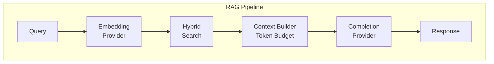

# Architecture

This document describes the internal architecture of the pgEdge RAG Server.

## Overview

The RAG server implements a Retrieval-Augmented Generation pipeline that:

1. Receives a user query
2. Generates an embedding for the query
3. Searches the database using hybrid search (vector + BM25)
4. Builds context from the most relevant documents
5. Generates an answer using an LLM with the context



## Components

### HTTP Server

The server uses Go's standard `net/http` package with the following
endpoints (all under the `/v1` API version prefix):

- `GET /v1/openapi.json` - OpenAPI v3 specification
- `GET /v1/health` - Health check
- `GET /v1/pipelines` - List available pipelines
- `POST /v1/pipelines/{name}` - Execute a RAG query

All JSON responses include an RFC 8631 `Link` header pointing to the OpenAPI
specification for API discovery by tools like restish.

Streaming responses use Server-Sent Events (SSE) for real-time output.

### Pipeline Manager

The pipeline manager (`internal/pipeline`) creates and manages pipeline
instances from the configuration. Each pipeline contains:

- Database connection pool
- Embedding provider
- Completion provider
- Orchestrator

### Orchestrator

The orchestrator (`internal/pipeline/orchestrator.go`) coordinates the RAG
pipeline execution:

1. **Query Embedding** - Converts the query to a vector using the embedding
   provider

2. **Hybrid Search** - For each configured column pair:

   - Vector search using pgvector similarity
   - BM25 text search for keyword matching
   - Results merged using Reciprocal Rank Fusion (RRF)

3. **Deduplication** - Removes duplicate results across column pairs

4. **Context Building** - Selects documents within the token budget,
   truncating the last document if needed to fit

5. **Completion** - Sends the context and query to the completion provider
   to generate an answer

### Hybrid Search

The server combines two search methods:

#### Vector Search

Uses PostgreSQL's pgvector extension for semantic similarity search:

```sql
SELECT id, content, embedding <=> $1 AS distance
FROM documents
ORDER BY embedding <=> $1
LIMIT $2
```

#### BM25 Search

Implements the Okapi BM25 algorithm for keyword matching:

- Tokenization with stop word removal
- IDF (Inverse Document Frequency) scoring
- Term frequency with length normalization

The BM25 implementation uses the Lucene-style IDF formula:

```
IDF = log(1 + (N - n + 0.5) / (n + 0.5))
```

Where:

- N = total number of documents
- n = number of documents containing the term

#### Reciprocal Rank Fusion

Results from both methods are combined using RRF:

```
RRF(d) = Σ 1 / (k + rank(d))
```

Where k=60 (the standard RRF constant). Documents appearing in both result
sets receive higher combined scores.

### LLM Providers

The server supports multiple LLM providers through a common interface:

```go
type EmbeddingProvider interface {
    Embed(ctx context.Context, text string) ([]float32, error)
    EmbedBatch(ctx context.Context, texts []string) ([][]float32, error)
    Dimensions() int
    ModelName() string
}

type CompletionProvider interface {
    Complete(ctx context.Context, req CompletionRequest) (*CompletionResponse, error)
    CompleteStream(ctx context.Context, req CompletionRequest) (<-chan StreamChunk, <-chan error)
    ModelName() string
}
```

Supported providers:

| Provider  | Package                     | Embedding | Completion |
|-----------|-----------------------------|-----------|------------|
| OpenAI    | `internal/llm/openai`       | Yes       | Yes        |
| Anthropic | `internal/llm/anthropic`    | No        | Yes        |
| Voyage    | `internal/llm/voyage`       | Yes       | No         |
| Ollama    | `internal/llm/ollama`       | Yes       | Yes        |

### Token Budget

The token budget prevents sending too much context to the LLM. The
orchestrator:

1. Estimates tokens for each document (approximately 4 characters per token)
2. Includes documents until the budget is reached
3. Truncates the final document at a sentence boundary if it exceeds the
   remaining budget

This ensures predictable LLM costs while maximizing relevant context.

## Database Schema Requirements

Each table used in a pipeline must have:

- A text column containing the document content
- A vector column containing the embedding (using pgvector)

Example schema:

```sql
CREATE EXTENSION IF NOT EXISTS vector;

CREATE TABLE documents (
    id SERIAL PRIMARY KEY,
    content TEXT NOT NULL,
    embedding vector(1536)  -- Adjust dimension for your model
);

-- Create index for fast similarity search
CREATE INDEX ON documents USING ivfflat (embedding vector_cosine_ops)
    WITH (lists = 100);
```

## Error Handling

The server uses structured error responses:

```json
{
  "error": {
    "code": "ERROR_CODE",
    "message": "Human-readable message"
  }
}
```

Error codes:

- `INVALID_REQUEST` - Bad request format or missing fields
- `PIPELINE_NOT_FOUND` - Requested pipeline doesn't exist
- `EXECUTION_ERROR` - Pipeline execution failed
- `STREAMING_ERROR` - SSE streaming failed
- `INTERNAL_ERROR` - Unexpected server error

## Logging

The server uses Go's structured logging (`log/slog`) with JSON output.
Log levels:

- `DEBUG` - Detailed execution information
- `INFO` - Normal operations
- `WARN` - Non-fatal issues (e.g., search failures on one column pair)
- `ERROR` - Failures requiring attention

## Concurrency

The server handles concurrent requests safely:

- Each request gets its own context
- Database connections are pooled
- BM25 index is cleared and rebuilt per-request (stateless)
- Streaming responses handle client disconnection via context cancellation
