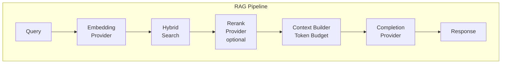

# Architecture

This document describes the internal architecture of the pgEdge RAG Server.

## Overview

The RAG server implements a Retrieval-Augmented Generation pipeline that:

1. receives a user query.
2. generates an embedding for the query.
3. searches the database using hybrid search (vector + BM25).
4. optionally reranks the retrieved documents with a rerank provider.
5. builds context from the most relevant documents.
6. generates an answer using an LLM with the context.


```mermaid
flowchart LR
    subgraph pipeline[RAG Pipeline]
        direction LR
        Q[Query] --> E[Embedding<br/>Provider]
        E --> H[Hybrid<br/>Search]
        H --> RR[Rerank<br/>Provider<br/>optional]
        RR --> C[Context Builder<br/>Token Budget]
        C --> CP[Completion<br/>Provider]
        CP --> R[Response]
    end
```

## Components

The RAG Server is made up of the following components.

**HTTP Server**

The server uses Go's standard `net/http` package with the following
endpoints (all under the `/v1` API version prefix):

- `GET /v1/openapi.json` - OpenAPI v3 specification
- `GET /v1/health` - Health check
- `GET /v1/pipelines` - List available pipelines
- `POST /v1/pipelines/{name}` - Execute a RAG query
- `GET /v1/stats` - Cumulative per-pipeline LLM token usage

All JSON responses include an RFC 8631 `Link` header pointing to the OpenAPI
specification for API discovery by tools like restish.

Streaming responses use Server-Sent Events (SSE) for real-time output.

**Pipeline Manager**

The pipeline manager (`internal/pipeline`) creates and manages pipeline
instances from the configuration. Each pipeline contains a:

- database connection pool
- embedding provider
- completion provider
- rerank provider (optional; only created when `rerank.provider` is
  configured for that pipeline)
- orchestrator

**Orchestrator**

The orchestrator (`internal/pipeline/orchestrator.go`) coordinates the RAG pipeline execution via:

1. **Query Embedding** - Converts the query to a vector using the embedding provider.

2. **Hybrid Search** - For each configured column pair:

   - Vector search using pgvector similarity
   - BM25 text search for keyword matching
   - Results merged using Reciprocal Rank Fusion (RRF)

3. **Deduplication** - Removes duplicate results across column pairs.

4. **Reranking** - If a rerank provider is configured, reorders the
   deduplicated results by relevance to the query, optionally keeping
   only the top-K of them. The stage is skipped when no provider is
   configured, and a rerank failure degrades to the original ordering
   rather than failing the query. See
   [Configuration](configuration.md) for the settings involved.

5. **Context Building** - Selects documents within the token budget,
   truncating the last document if needed to fit.

6. **Completion** - Sends the context and query to the completion provider
   to generate an answer.


## Hybrid Search Support

The server combines two search methods: Vector search and BM25 search.

**Vector Search**

Uses PostgreSQL's pgvector extension for semantic similarity search:

```sql
SELECT id, content, embedding <=> $1 AS distance
FROM documents
ORDER BY embedding <=> $1
LIMIT $2
```

**BM25 Search**

Implements the Okapi BM25 algorithm for keyword matching:

- Tokenization with stop word removal
- IDF (Inverse Document Frequency) scoring
- Term frequency with length normalization

The BM25 implementation uses the Lucene-style IDF formula:

```
IDF = log(1 + (N - n + 0.5) / (n + 0.5))
```

Where:

- N = total number of documents
- n = number of documents containing the term

**Reciprocal Rank Fusion**

Results from both methods are combined using RRF:

```
RRF(d) = Σ 1 / (k + rank(d))
```

Where k=60 (the standard RRF constant). Documents appearing in both result
sets receive higher combined scores.


## LLM Providers

Provider implementations live in
[`pgedge-go-llm-lib`](https://github.com/pgEdge/pgedge-go-llm-lib),
which exposes them all through its single `llm.Client` interface. The
factory in `internal/llm/factory.go` constructs a client for a given
provider and capability (`NewEmbeddingClient`, `NewCompletionClient`,
and `NewRerankClient`), rejecting at construction time any provider
that does not support the capability being asked for.

The orchestrator does not consume `llm.Client` wholesale; it depends on
the narrow interfaces declared in `internal/pipeline/interfaces.go`,
which the library's client satisfies structurally, so that tests can
supply small mocks in place of a real provider:

```go
type Embedder interface {
    Embed(ctx context.Context, text string) ([]float64, error)
    Usage() llmlib.TokenUsage
    Ping(ctx context.Context) error
}

type Completer interface {
    Chat(ctx context.Context, req llmlib.ChatRequest) (*llmlib.ChatResponse, error)
    ChatStream(ctx context.Context, req llmlib.ChatRequest) (*llmlib.Stream, error)
    Usage() llmlib.TokenUsage
    Ping(ctx context.Context) error
}

type Reranker interface {
    Rerank(ctx context.Context, req llmlib.RerankRequest) (*llmlib.RerankResponse, error)
}
```

Embeddings are returned as `[]float64` and converted to the `[]float32`
that pgvector expects at the point of use.

Supported providers:

| Provider  | Configuration name | Embedding | Completion | Rerank |
|-----------|--------------------|-----------|------------|--------|
| OpenAI    | `openai`           | Yes       | Yes        | No     |
| Anthropic | `anthropic`        | No        | Yes        | No     |
| Gemini    | `gemini`           | Yes       | Yes        | No     |
| Voyage    | `voyage`           | Yes       | No         | Yes    |
| Ollama    | `ollama`           | Yes       | Yes        | No     |


## Token Budget

The token budget prevents sending too much context to the LLM. The orchestrator:

1. Estimates tokens for each document (approximately 4 characters per token)
2. Includes documents until the budget is reached
3. Truncates the final document at a sentence boundary if it exceeds the
   remaining budget

This ensures predictable LLM costs while maximizing relevant context.


## Database Schema Requirements

Each table used in a pipeline must have:

- A text column containing the document content
- A vector column containing the embedding (using pgvector)

Example schema:

```sql
CREATE EXTENSION IF NOT EXISTS vector;

CREATE TABLE documents (
    id SERIAL PRIMARY KEY,
    content TEXT NOT NULL,
    embedding vector(1536)  -- Adjust dimension for your model
);

-- Create index for fast similarity search
CREATE INDEX ON documents USING ivfflat (embedding vector_cosine_ops)
    WITH (lists = 100);
```

## Error Handling

The server uses structured error responses:

```json
{
  "error": {
    "code": "ERROR_CODE",
    "message": "Human-readable message"
  }
}
```

Error codes:

- `INVALID_REQUEST` - Bad request format or missing fields
- `PIPELINE_NOT_FOUND` - Requested pipeline doesn't exist
- `EXECUTION_ERROR` - Pipeline execution failed
- `STREAMING_ERROR` - SSE streaming failed
- `INTERNAL_ERROR` - Unexpected server error


## Logging

The server uses Go's structured logging (`log/slog`) with JSON output.
Log levels:

- `DEBUG` - Detailed execution information
- `INFO` - Normal operations
- `WARN` - Non-fatal issues (e.g., search failures on one column pair)
- `ERROR` - Failures requiring attention


## Concurrency

The server handles concurrent requests safely:

- Each request gets its own context
- Database connections are pooled
- BM25 index is cleared and rebuilt per-request (stateless)
- Streaming responses handle client disconnection via context cancellation
